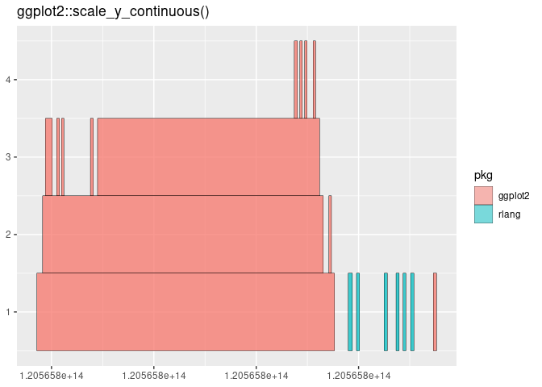

<!-- README.md is generated from README.Rmd. Please edit that file -->

# trace.package

<!-- badges: start -->
<!-- badges: end -->

The goal of trace.package is to make it easy to trace, profile and
benchmark

## Installation

You can install the development version of trace.package like so:

``` r
remotes::install_github("maxsutton/trace.package")
```

## Usage

This is a basic example which shows you how to trace calls of functions
from the `ggplot2` package when creating an empty ggplot scale.
`run_trace()` returns a data.frame that can be analysed in any way that
the user would like. `run_trace()` also accepts a vector of packages to
trace.

``` r
library(trace.package)

df <- run_trace(ggplot2::scale_y_continuous(), "ggplot2")
#> Tracing packages...
#> Evaluating expression...
#> Removing trace from packages...
head(df)
#> # A tibble: 6 × 17
#>   raw         id info  pkg      time entry call  fun   up_down depth match_depth
#>   <chr>    <int> <chr> <chr>   <dbl> <lgl> <chr> <chr>   <dbl> <dbl>       <dbl>
#> 1 "Tracin…     1 #ggp… ggpl… 1.21e14 TRUE  "ggp… ggpl…       1     1           1
#> 2 "#ggplo…     2 #ggp… ggpl… 1.21e14 TRUE  "con… cont…       1     2           2
#> 3 "#ggplo…     3 #ggp… ggpl… 1.21e14 TRUE  "sta… stan…       1     3           3
#> 4 "#ggplo…     4 #ggp… ggpl… 1.21e14 FALSE "sta… stan…      -1     2           3
#> 5 "#ggplo…     5 #ggp… ggpl… 1.21e14 TRUE  "wai… waiv…       1     3           3
#> 6 "#ggplo…     6 #ggp… ggpl… 1.21e14 FALSE "wai… waiv…      -1     2           3
#> # ℹ 6 more variables: pair_id <int>, duration <dbl>, t1 <dbl>, t2 <dbl>,
#> #   x1 <dbl>, x2 <dbl>
```

However, `trace.package` comes baked in with some functions to
kick-start analysis of the traces. The first is a traditional flame
graph, which shows a stack of function calls and the time spent in each
of those stacks. The ggplot object is returned, and so you can apply
ggplot functions to change the appearance of the graph.

In this case, it shows also shows some `rlang` functions that are
imported by `ggplot2`.

``` r
gg <- flame_graph(df)

gg
```

 Another tool
is printing a tree of the function calls, to see the flow of code when
executing an expression. Here we can choose what we want to print,
either the exact call made at each point, or just the function in that
call, or any other variable in the data.frame.

``` r
code_tree(df, label = fun)
#> ggplot2::scale_y_continuous
#> ├─continuous_scale
#> | ├─standardise_aes_names
#> | ├─waiver
#> | ├─waiver
#> | ├─waiver
#> | └─ggproto
#> |   ├─waiver
#> |   ├─waiver
#> |   ├─waiver
#> |   └─check_fun
#> └─waiver
#> enexpr
#> enexpr
#> enexpr
#> enexpr
#> enexpr
#> enexpr
#> expansion
```

`trace.package` also comes with a useful utility to add colour to the
text labels, in a way just like `dplyr::recode`. We can do that to
colour the `ggplot2` and `rlang` package like in the flame graph above.
Colours are limited to those available in the `crayon` package. It
doesn’t come across well on github, but looks good in the console (I
promise).

``` r
code_tree(df, label = recolour(fun, pkg, "ggplot2" = "red", rlang = "blue"))
#> ggplot2::scale_y_continuous
#> ├─continuous_scale
#> | ├─standardise_aes_names
#> | ├─waiver
#> | ├─waiver
#> | ├─waiver
#> | └─ggproto
#> |   ├─waiver
#> |   ├─waiver
#> |   ├─waiver
#> |   └─check_fun
#> └─waiver
#> enexpr
#> enexpr
#> enexpr
#> enexpr
#> enexpr
#> enexpr
#> expansion
```
